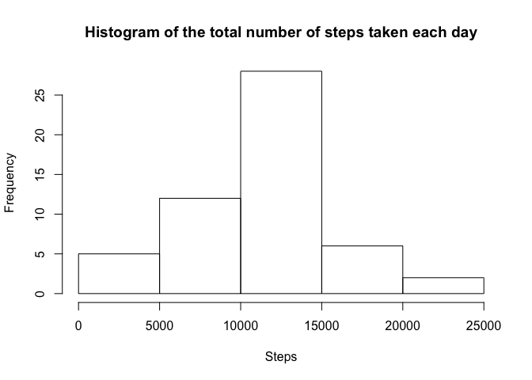
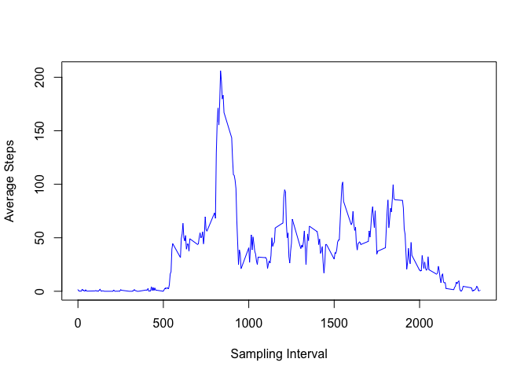
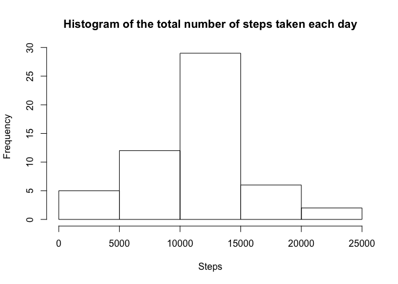
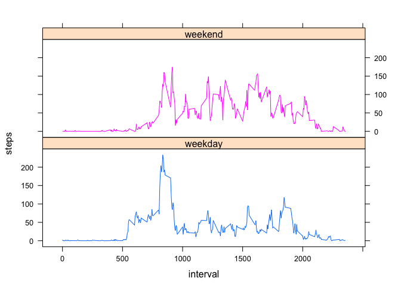

# Reproducible Research: Peer Assessment 1

## Loading and preprocessing the data

The activity.csv file contains the data from a personal activity monitoring device. This device collects data at 5 minute intervals through out the day. The data consists of two months of data from an anonymous individual collected during the months of October and November, 2012 and include the number of steps taken in 5 minute intervals each day.


```r
fileName <- "activity.zip"
con <- unz(fileName, filename="activity.csv");
data <- read.csv(con, header=T)
```

## What is mean total number of steps taken per day?

Histogram plot of the total number of steps taken per day


```r
total_steps <- aggregate(steps ~ date, data=data, FUN=sum)
hist(total_steps$steps, main="Histogram of the total number of steps taken each day"
     ,xlab = "Steps")
```

 

The mean and median of the total number of steps taken per day


```r
mean(total_steps$steps)
```

```
## [1] 10766.19
```

```r
median(total_steps$steps)
```

```
## [1] 10765
```

## What is the average daily activity pattern?

The time series plot of the 5-minute interval and the average number of steps taken, averaged across all days


```r
steps_5min <- aggregate(steps ~ interval, data = data, mean)
plot(steps_5min$interval, steps_5min$steps,  type="l", col="blue", xlab="Sampling Interval", ylab="Average Steps")
```

 

The 5-minute interval, on average across all the days in the dataset, contains the maximum number of steps:


```r
mrow <- which.max(steps_5min[,"steps"] )
steps_5min[mrow, "interval"]
```

```
## [1] 835
```

From the plot, it is obvious that 5-minute interval 835 contains the maximum number of steps

## Imputing missing values

The total number of missing values in the dataset 


```r
naField <- data[is.na(data$steps),]
nrow(naField)
```

```
## [1] 2304
```

Fill in all of the missing values in the dataset using the mean for that 5-minute interval. Create a new dataset(newData) that is equal to the original dataset but with the missing data filled in.


```r
data_new <- data
repv <- function(interv){steps_5min[steps_5min$interval==interv, "steps"]}
data_new$steps[is.na(data_new$steps)] <- repv(data_new$interval[is.na(data_new$steps)])
```

Plot the new histogram of the total number of steps taken per day: 


```r
total_steps_new <- aggregate(steps ~ date, data = data_new, FUN = sum)
hist(total_steps_new$steps, main="Histogram of the total number of steps taken each day"
     ,xlab = "Steps")
```

 

The new mean and median of the total number of steps taken per day


```r
mean(total_steps_new$steps)
```

```
## [1] 10766.19
```

```r
median(total_steps_new$steps)
```

```
## [1] 10765.59
```
The new values are differ from the estimates from the first part of the assignment.  By imputing missing data, the estimates of the total daily number of steps may increase. Depend on the imputing strategy, the mean may not change. The median is changed due to one more day is taken into consideration. 

## Are there differences in activity patterns between weekdays and weekends?

Add weekday and weekend factor column to data_new

```r
data_new$day_type = as.factor(ifelse(weekdays(as.Date(data_new$date, format = "%Y-%m-%d")) %in% c("Saturday","Sunday"), "Weekend", "Weekday")) 
```

Comparing the 5-minute interval and the average number of steps taken, averaged across all weekday days or weekend days. 


```r
data_weekend <- data_new[data_new$day_type=="Weekend", ]
data_weekday <- data_new[data_new$day_type=="Weekday", ]

steps_5min_weekend <- aggregate(steps ~ interval, data = data_weekend, mean)
steps_5min_weekend$day_type = "weekend"
steps_5min_weekday <- aggregate(steps ~ interval, data = data_weekday, mean)
steps_5min_weekday$day_type = "weekday"
dat <- rbind(steps_5min_weekend, steps_5min_weekday);

library(lattice) 
xyplot(steps ~ interval|day_type,       ## conditional formula to get 4 panels
       data =dat,       ## data
       type='l',        ## line type for plot
       groups=day_type,     ## group ti get differents colors
       layout=c(1,2))   ## equivalent to par or layout
```

 

According to the plots, there are differences in activity patterns between weekdays and weekends?
